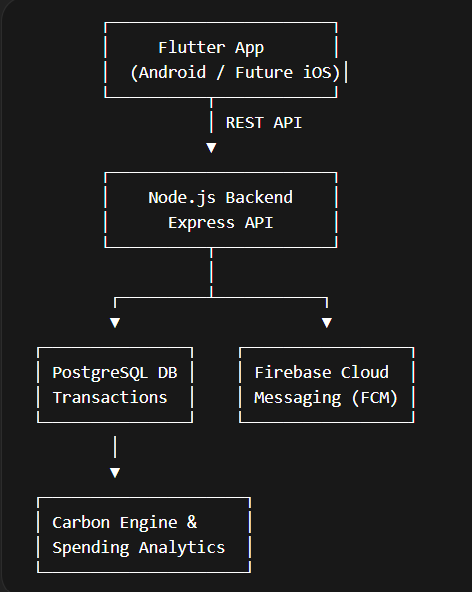

# PAY KARO - "Pay Smart. Track Smart. Live Green."

PAY KARO is a next-generation UPI-powered fintech mobile application designed to simplify digital payments while providing deep financial insights and environmental impact tracking.

Unlike traditional payment apps, PAY KARO helps users understand spending behavior, manage shared expenses, and measure the carbon footprint of their purchases
## PROBLEM:

 -  Understand where their money goes  

 -  Split expenses easily among friends 
 -  Track the environmental impact of spending
 -  Get smart financial insights

 Users need **more than payments — they need financial intelligence.**

---

## 💡 Solution

PAY_KARO combines **UPI payments, expense analytics, group splitting, and carbon footprint tracking** in one simple platform.

It helps users **pay smarter, spend smarter, and live greener.**

---

###  💳 Smart Payments

- Send money instantly
- Scan & Pay QR
- Transaction history

### 👥 Split Payments
- Create group expenses
- Auto calculate balances
- Settle debts easily

### 📊 Spending Insights
- Monthly expense analytics
- Category breakdown
- Smart financial suggestions

### 🌱 Carbon Footprint Tracker
- Estimate environmental impact of spending
- Suggest eco-friendly alternatives

### 🔐 Secure Authentication
- OTP login
- Secure API access

---

## 🏗 System Architecture

## Project Structure
## 📱Screenshots

## 📱 Screenshots

  
  
  

  
  

## Tech Stack

**Frontend:** Flutter

**Backend:** Node.js + Express

**Database:** PostgreSQL / Firebases

**Authentication:** JWT / OTP

**APIS:** UPI / Payment Gateway

---

## 🚀Installation

**Clone repository:**
git clone https://github.com/omkar30rj-design/pay-karo

**Backend Setup:**
cd backend
npm install
npm start

**flutter setup:**
cd flutter
flutter pub get
flutter run

## Authors

- team_ShadowX

